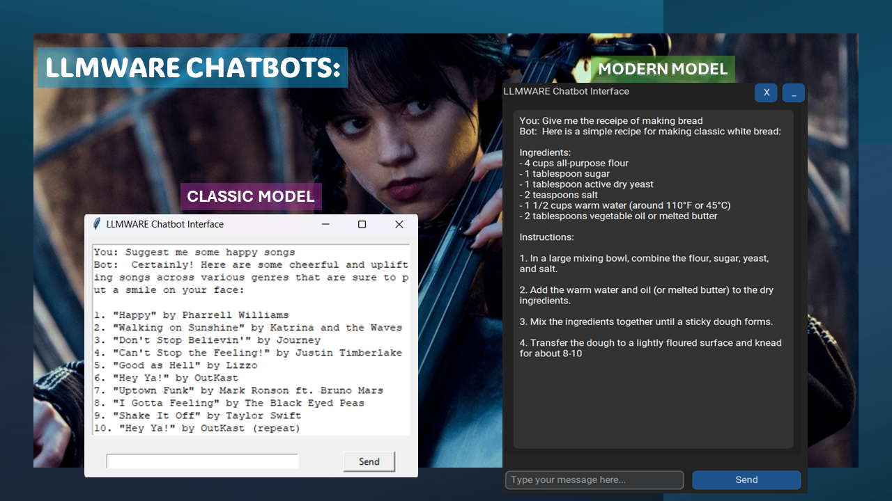
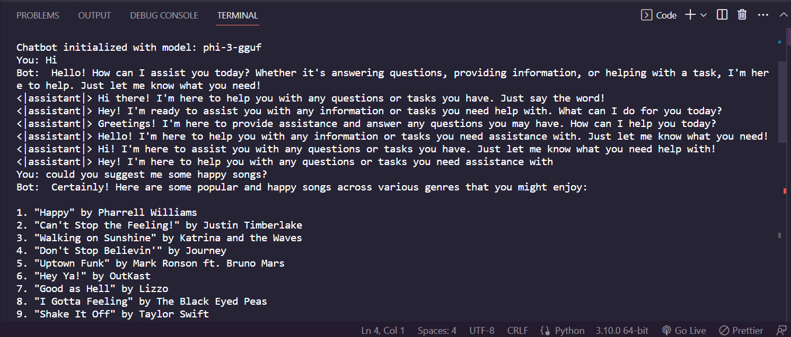
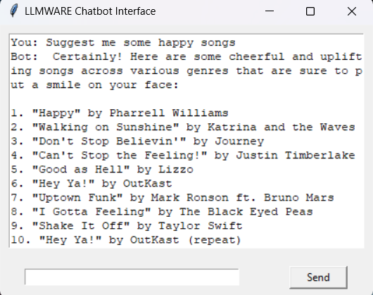
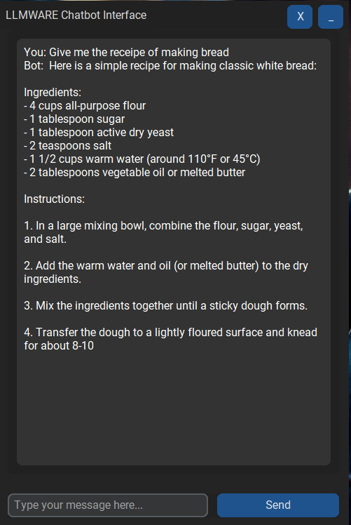
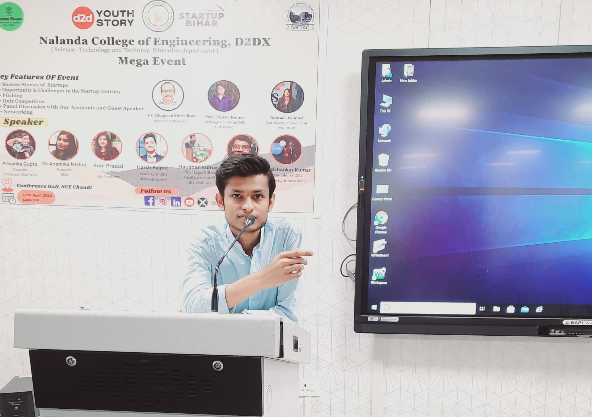

<p align="right">
    
</p>

#

<h1 align="center">
    AI CHaTBoT 🤖
</h1>

<p align="center">
  
  interface
</p>


## AI ChaTBoT 🤖 
- A powerful chatbot that can answer all your doubts whether it's your science question or maths homework.
- Just imagine the power of this ChaTBoT, built using LLMWARE integrated with the model "**phi-3-gguf**".

#

## :books: Index

- [Demo](#movie_camera-Demo)
- [Screenshots](#screenshots)
- [Set Up](#outbox_tray-Set-up)
- [Contribute](#building_construction-Contribute)
- [Project Author](#people_holding_hands-Meet-the-Author)
- [Contact](#email-contact)

#

###  :movie_camera: Demo
- After a brief introduction, let's dive a little more inside the project.
- Here is the walk-through of **AI ChaTBoT 🤖**. If you want to witness a more a hd version, [click here](https://github.com/RS-labhub/AI-CHaTBoT/blob/master/Assets/LLMWARE%20CHatBot%20Preview.mp4)

https://github.com/RS-labhub/AI-CHaTBoT/assets/117426013/8157ceed-e0ef-4671-b1ec-f22604306ea7

<p align="center">Video Demonstration</p>

### Screenshots

<p align="center">
  
  <p align="center">Python version</p>
  <br>
  <p align="center">
  
  <p align="center">Tkinter Classic GUI</p>
  <br>
  <p align="center">
  
  <p align="center">Tkinter Modern GUI</p>
</p>

<br>


## Dependecies
1. **Python**
2. *LLMWARE*
3. **Tkinter**

#

##  :outbox_tray: Installation Guide
- These are the steps required to install the python project:


1. Clone the Repository: Open a terminal or command prompt and clone the AI-CHaTBoT repository from GitHub using the following command:

  ```bash
    git clone https://github.com/RS-labhub/AI-CHaTBoT.git
  ```

2. Navigate to the Repository Directory: Change your current directory to the cloned AI-CHaTBoT repository:

  ```bash
    cd AI-CHaTBoT
  ```

3. Install Dependencies: Use pip to install the required Python dependencies listed in the requirements.txt file:

  ```bash
    pip install -r requirements.txt
  ```

4. Run AI-CHaTBoT application using the following command:

  ```py
    run chatbot.py
  ```

5. Once the application is running, type your query, and get the results.

<br>

> Note: When running it for the first time, it can take about 10-15mins, as per your system's specification. It is highly recommended to use in the system which have atleast 8Gb of RAM and some Graphics Card.

<br>

**Tkinter Install Guidelines**

1. Head over to the Chatbot UI Folder. Their you'll find two files, 
```py
    ChatbotGUI_Old.py
```
```py
    ChatbotGUI_Modern.py
```

2. Open one of the file of your choice, and make sure that you have already installed the requirements. If not, install now:
```py
    pip install -r requirements.txt
```

3. Now, just run the application. A prompt will open. And you can test-run the application.
```py
    run ChatbotGUI_Old.py
```
```py
    run ChatbotGUI_Modern.py
```
<br>
<p align="center">
  The running shell should look like this
</p>
<p align="center">


</p>
<br>

## What to do after installation?
Once AI-CHaTBoT is installed and running, you can use it to get your answers. Input your message in the provided text-area, and get to know the results after clicking on the send button.


$~$

## Setup and Contributing Guidelines
    
**Set Up Your Environment**

1. `Fork` our repository to your GitHub account. 
2. `Clone` your fork to your local machine. 
    Use the command `git clone https://github.com/RS-labhub/AI-CHaTBoT.git`.
3. Create a new branch for your work. 
    Use a descriptive name, like `fix-login-bug` or `add-user-profile-page`.
    
**Commit Your Changes**

- Commit your changes with a _clear commit message_. 
  e.g `git commit -m "Fix login bug by updating auth logic"`.

**Submit a Pull Request**

- Push your branch and changes to your fork on GitHub.
- Create a pull request, compare branches and submit.
- Provide a detailed description of what changes you've made and why. 
  Link the pull request to the issue it resolves. 🔗
    
**Review and Merge**

- I will review your pull request and provide feedback or request changes if necessary. 
- Once your pull request is approved, we will merge it into the main codebase 🥳

$~$

## :people_holding_hands: Meet the Author




### :email: Contact 
- Email: rs4101976@gmail.com
- Head over to my github handle from [here](https://github.com/RS-labhub)

<br>

<p align="center">
<a href="https://twitter.com/rrs00179" target="blank"></a>
<a href="https://www.linkedin.com/in/rohan-sharma-9386rs/" target="blank"></a>
</p>

<br>

<p align="center">
   Thank you for visting this Repo <br>If you like it, <a href="https://github.com/RS-labhub/I-Love-You/stargazers">star</a> ⭐ it
</p>
