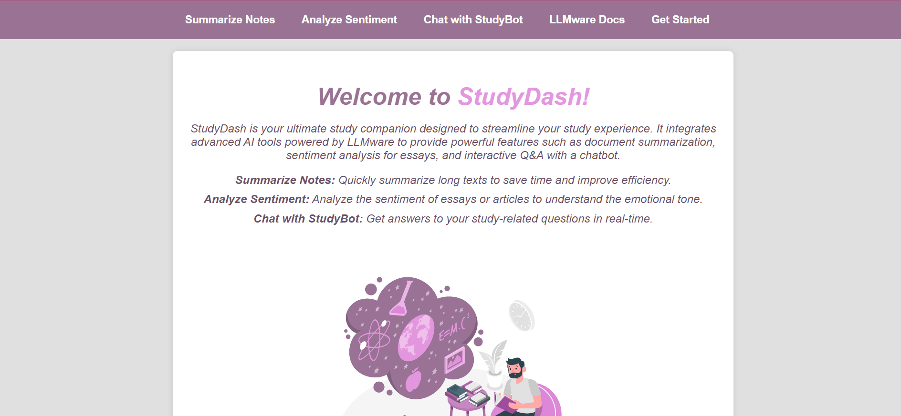
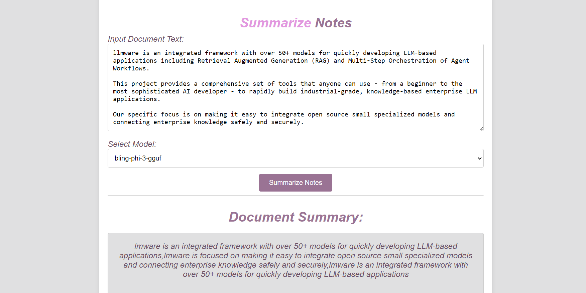
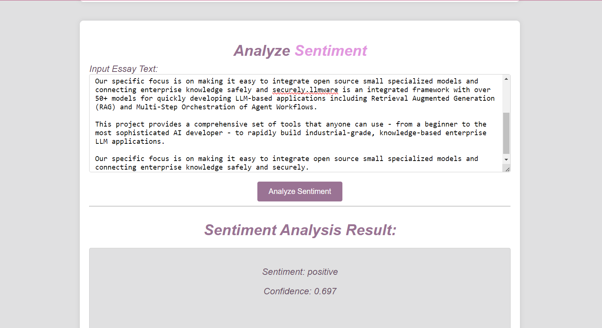
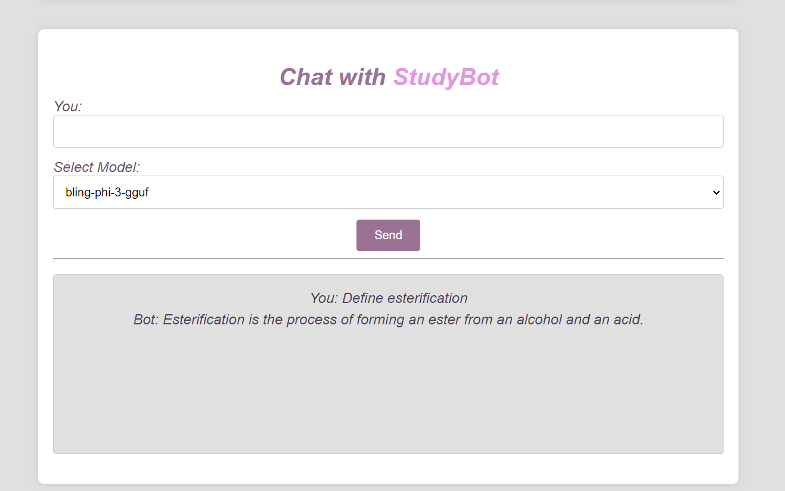

# StudyDash 📘🤖

StudyDash is an advanced study companion application designed to streamline your study experience. It integrates powerful AI tools powered by LLMWare to provide various features such as document summarization, sentiment analysis for essays, and interactive Q&A with a chatbot.

## Features 🚀

- **Summarize Notes:** Quickly summarize long texts to save time and improve study efficiency.
- **Analyze Sentiment:** Evaluate the sentiment of essays or articles to understand the emotional context.
- **Chat with StudyBot:** Engage in interactive Q&A sessions with an AI-powered chatbot for study-related queries.

## Technologies Used 🛠️

- **Python:** Backend development and integration with AI models.
- **Flask:** Web framework for building the backend server.
- **LLMWare** For the models 
- **HTML/CSS/JavaScript:** Frontend development for the user interface.
- **jQuery:** JavaScript library for simplified AJAX interactions.

## LLMWare Integration 🤖

StudyDash leverages the capabilities of LLMWare, a powerful AI platform, to provide advanced study features:

- **Document Summarization:** Utilizes LLMWare's `slim-summary-tool` model for generating concise summaries.
- **Sentiment Analysis:** Implements LLMWare's `sentiment` tool for analyzing the sentiment of text inputs.
- **Chatbot:** Integrates LLMWare's `bling-phi-3-gguf` model for interactive chatbot responses.

## Getting Started 🚀

To get started with StudyDash locally, follow these steps:

1. Clone the StudyDash repository:
   ```bash
   git clone https://github.com/yourusername/studydash.git
   cd studydash
   ```
2. Set up a Virtual Environment and install dependencies:
   ```bash
    python -m venv venv
    source venv/bin/activate   # On Windows use `venv\Scripts\activate`
    pip install -r requirements.txt
   ```
3. Run the application:
   ```bash
   python app.py
   ```
4. Access StudyDash in your browser at http://localhost:5000.

## Models Used 🤖

- **Slim Summary Tool:** Model for document summarization.
- **Sentiment:** Model for sentiment analysis.
- **Bling Phi 3 GGUF:** Model for interactive chatbot responses.

## Screenshots

      

**⚡Home Screen**

      
**🎄Summarize Screen**


**🚀Sentiment Analysis Screen**


**🤖Chatbot Screen**

## Video Demo ⚡

Checkout the demo here: https://youtu.be/fDc5ZERXJ7c


## Contributing 🤝
Contributions to StudyDash are welcome! If you have ideas for new features, improvements, or bug fixes, feel free to open an issue or submit a pull request on the GitHub repository.

## License 📜
This project is licensed under the [MIT License](LICENSE).


