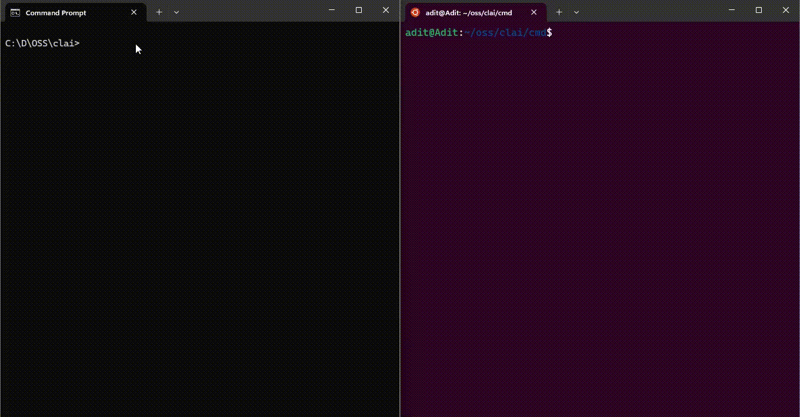

# Clai 📟
Clai is an open-source CLI tool powered by AI that assists in providing CLI command suggestions using natural language. This tool utilizes open-source models and can be self-hosted, making it highly customizable and privacy-friendly. It is particularly relevant for enterprise environments where the confidentiality of internal tools is paramount. Huge thanks to [LLMWare](https://llmware.ai) for providing the tools and LLM models, making all this possible.
# Preview 📷

More details: 
[Youtube](https://www.youtube.com/watch?v=oqDiBObsj4o)
# Usage 🎚️
## Requirements 🛠️
Tested on:
- Golang 1.22.3
- Python 3.10.12
## Running 🏃‍♂️
### Server:
The server is used to perform inference for command suggestions from the AI model we utilize.
- It is highly recommended to use a virtual environment in Python. For example: `python -m venv [your-venv-name]`.
- go to server folder then run: `pip install -r requirements.txt`
- run server: `fastapi dev main.py`
- Your server will run on port **8000** by default. 
### Cmd:
In this folder, there is a client tool which is the core of this program. It can be used by invoking it directly from the shell. Developed using Golang, it is multi-platform and supports cross-compilation.
- go to cmd folder
- make sure your **server_url** correctly points to your server in **config.json** file
- make sure you have all dependencies ready: `go mod tidy`
- build the binary: `go build clai.go`
- use it: `./clai [your query]`