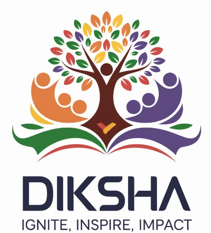

## **"Empowering Dreams, Bridging Gaps, Transforming Futures."**

**Diksha** is an innovative platform designed to empower underprivileged students by providing access to high-quality education and personalized learning experiences. Our mission is to bridge the educational gap and offer students a chance to explore, learn, and grow, regardless of their socio-economic background.

## **Project Overview**

### **Empowering Underprivileged Learners for a Bright Future**  
Our mission is to **redefine education for underprivileged students** who are often left behind due to the lack of access to quality learning resources, skills development, and career guidance. This platform is designed to **empower every student** to unlock their true potential, enabling them to compete in today’s fast-paced, technology-driven society.

We bridge the gap between **traditional schooling** and **real-world success**, helping students build essential skills, foster their curiosity, and make informed decisions about their futures. Whether it’s academics, personal growth, or career planning, our platform serves as a **complete solution**, providing comprehensive tools that students can access at **minimal cost**.

---

#### **Inspiration**

In our state, particularly in rural and semi-urban areas, students are brimming with untapped potential. Yet, they face a harsh reality: the digital divide and lack of exposure to technology rob them of opportunities to shine in today’s fast-paced, tech-driven world. These young minds, often the first in their families to dream of higher education, are held back by systemic challenges.  

Imagine a classroom where students are eager to learn, but they don’t have access to computers. Picture a teenager with incredible problem-solving skills who has never heard of coding. Visualize a community where dreams of a better future are stifled by the absence of mentors, guidance, and career clarity. This is the current state for many students in our rural and semi-urban regions.  

Despite their talent and determination, these students encounter:  
- **A lack of awareness** about opportunities in technology and beyond.  
- **Scarce resources**—few computers, unreliable internet, and outdated learning materials.  
- **Limited mentorship**, leaving them directionless in choosing careers or developing skills.  
- **An education system** that prioritizes rote learning over hands-on experience, making it difficult to compete in a global job market.  
-----

## **Key Features**

### 🌟 **Dynamic Curriculum Generator**  
**Revolutionize the way students learn!** Our **Dynamic Curriculum Generator** empowers students by curating **personalized learning paths** based on their **current grade level** and **interests**. Students can explore a vast array of topics, and when they find something that excites them, they can dive deeper into that subject. The curriculum adapts in real-time, allowing students to discover **new interests** and **develop skills** in a highly engaging, self-paced manner. This personalized approach ensures that no student is ever stuck with irrelevant or outdated content.

### 🤖 **24/7 Doubt-Solving Assistant**  
**Never stop learning, never stop solving.** Our **AI-powered assistant** is available 24/7, offering immediate answers to both **academic and general queries**. Whether it’s a math problem, a scientific concept, or a question about life skills, students can rely on the assistant for **instant help**. With the power of AI, this assistant can provide **accurate and relevant answers** in real-time, breaking down barriers that prevent students from progressing.

### 🎨 **Visual Doubt-Solving Tool**  
Sometimes, a **visual solution** makes all the difference. Our **Visual Doubt-Solving Tool** allows students to upload images of their problems and receive **detailed visual solutions**. This includes things like **step-by-step illustrations**, **graphs**, and **diagrams** that simplify complex problems. This visual approach gives students an **intuitive understanding** of the solution, helping them better grasp challenging concepts without getting bogged down in dense explanations. Learning through **visual aids** accelerates understanding and retention.

### 📝 **Practice Section for Academic and Interest-Based Subjects**  
**Master any subject** with continuous practice! The **Practice Section** allows students to engage in **interactive quizzes** and **exercises** designed to reinforce learning, both for **academic subjects** and **personal interests**. This flexible feature ensures that students not only excel in their school subjects but also have the opportunity to explore and develop expertise in areas that fascinate them, whether it’s coding, music, art, or beyond. Regular practice, with instant feedback, ensures that students continuously improve.

### 🔥 **Flashcards Generator with Gamification**  
Learning is more fun when it feels like a game! Our **Flashcards Generator** enables students to create **custom flashcards** to practice key concepts. Through **gamification**, we transform study sessions into engaging, competitive challenges where students earn rewards and achievements. This interactive tool makes **reviewing content** enjoyable and keeps students motivated as they move through their learning journey.

### 📰 **Tech Newsletters for Future-Ready Students**  
Stay ahead of the curve! Our **Tech Newsletter** keeps students updated with the latest trends in technology, career opportunities, and industry news. By subscribing for free, students receive curated **insights** directly in their inbox, ensuring they stay informed and **ready for the future**. From breakthrough innovations in AI to new job roles emerging in the tech industry, the newsletter helps students stay **knowledgeable and future-ready**.

---
## **Technologies & Tools Used -**

- **Frontend**: CSS, JavaScript, ejs  
- **Backend**: NodeJS, ExpressJS, MongoDB Atlas  
- **Framework**: Bootstrap  
- **LLMWare**:  
  - LLaMA-2-7b-Chat-GGUF (Chatbot & Problem-solving in Visual Problem Solving)  
  - phi3-GGUF (Dynamic Curriculum Generator)  
  - tiny-LLamA-chat-GGUF (Ask Me Anything)  
- **OCR**: Gemini API  
- **Other Tools**: Libraries, Python  

---

### Challenges We Ran Into

1. **Model Size and Documentation**: One of the key challenges we faced was managing the large AI models, such as **LLaMA-2**, which significantly impacted performance and memory usage. Additionally, the complexity of model documentation made the integration process difficult and time-consuming, requiring careful handling and understanding to implement effectively.

2. **Integration and Optimization**: Running large models like **LLaMA-2** on devices with limited computing power and bandwidth posed another challenge. Optimizing these models for performance while maintaining functionality and user experience was crucial. We had to ensure that the platform remained responsive and efficient, even on lower-end devices.

3. **OCR-Based Doubt-Solving Tool**: Developing an accurate OCR system to read and solve problems from scanned or handwritten content was a complex task. Ensuring the OCR tool could handle varying handwriting styles and image quality while providing accurate, real-time solutions was a significant hurdle.

Despite these challenges, we successfully overcame each issue by optimizing models, refining the integration process, and ensuring the accuracy of our tools. This allowed us to deliver a seamless and functional learning experience for underprivileged students.

---
## **Access and Reach**

### **Designed for Accessibility on Mobile Devices**  
In today’s digital age, **mobile phones are a basic necessity**. Our platform is built with this in mind, offering a **mobile-first design** that works seamlessly across all devices. By adopting **Progressive Web App (PWA) technology**, we ensure that students can access the platform efficiently even on **low-bandwidth connections** and **basic smartphones**. This low-cost, high-performance solution guarantees that students from any background can stay connected to quality learning, anywhere and anytime.

### **Expanding Reach through Partnerships and Franchises**  
We are committed to making this platform accessible to all. Our strategy includes:
- **Franchise Model for Local Schools**: Partner with schools to offer the platform as an **affordable addition** to their curriculum, ensuring that students can access premium features at a **low cost**. This makes education accessible without financial barriers.
- **Collaborations with Governments and NGOs**: We actively partner with **local governments**, **NGOs**, and **charitable organizations** to provide access to this platform at **no cost** or a **subsidized fee**, ensuring that even the most underprivileged students can benefit.

---

## **Revenue Model**

### **Sustainable Revenue Through Ethical Advertising**  
We prioritize **education over profit**. Our **advertising-based revenue model** ensures that students have access to high-quality content without compromising their experience. By displaying **non-intrusive, relevant ads**, we generate revenue that supports the platform’s development and maintenance, without affecting students’ learning journey. This ensures that our platform remains **low-cost** and **highly effective**, providing maximum value to our users.

---

## **What’s Next: Future Directions**

As we continue to innovate and expand our platform, we have an exciting roadmap that will bring even more value to our students, mentors, and communities. Here’s what’s coming next:

🌍 AI-Powered Personalized Learning Paths
We are integrating AI-powered personalization to create dynamic learning paths for each student. The AI will adapt to their learning style, performance, and interests, providing tailored recommendations for lessons and resources. This means that, in the near future, every student will have a customized learning journey that optimally supports their progress, engagement, and growth.

🤝 Personalized Mentorship at Scale
Our vision for mentorship is evolving. We’re working on creating a scalable mentorship program, where one-on-one sessions and expert talks will become more accessible. By connecting students with experienced mentors in various fields, we’ll help students receive personalized guidance on career paths, domain selection, and skills development. This future program will empower students with real-world advice, helping them make informed decisions about their futures.

💡 Career Guidance and Expert-Led Workshops
We're expanding our focus to career readiness. Alongside academic content, we will offer regular career counseling sessions, industry expert talks, and vocational training programs. These initiatives will provide students with the tools to navigate the job market, develop industry-relevant skills, and select the right career domains. This holistic approach will ensure that students are not only academically prepared but also workforce-ready for today’s competitive world.

### **Join Us in Empowering the Next Generation**

We believe every student deserves the tools to succeed. Our platform is **more than just an educational tool** — it’s a **launchpad for success**, giving students the confidence and resources they need to thrive in a fast-changing world. With your support, we can reach more students and help them achieve their full potential.
